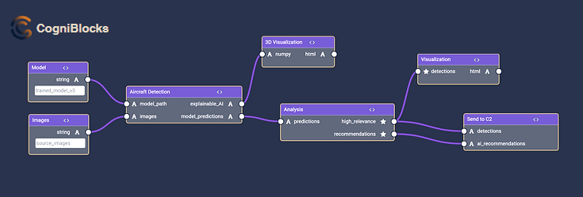
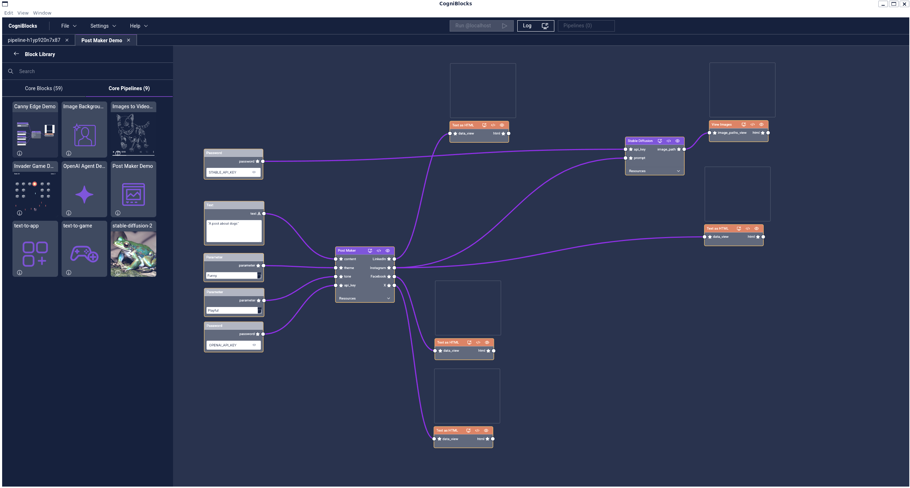
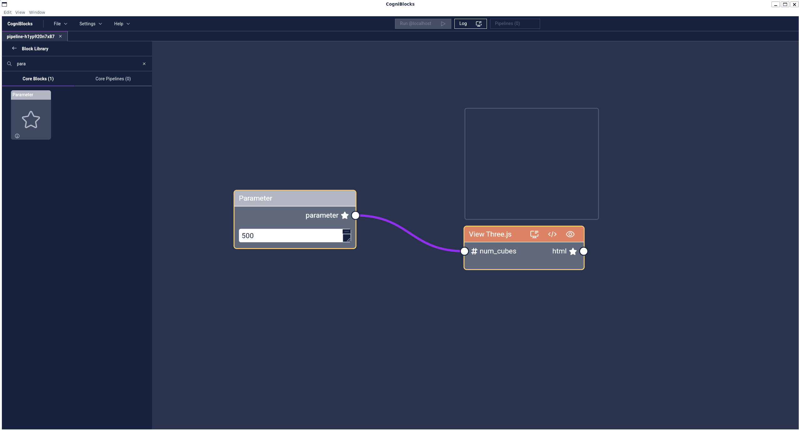

<div align="center">

[](https://x.com/CogniBlocks)

<h3 style="padding-bottom: 15px">
A comprehensive, open-source AI framework engineered for the efficient development and deployment of sophisticated AI and AGI pipelines.
</h3>



</div>

<a id="why-cogniblocks"></a>

## 🔥 Why CogniBlocks?

CogniBlocks represents an advanced AI development ecosystem designed to optimize the construction and deployment of cutting-edge AI architectures. By leveraging a modular, reusable, and containerized infrastructure, CogniBlocks facilitates seamless AI pipeline construction, fostering high-level innovation and collaborative synergy.

- **Language-Agnostic Design:** Deploy AI solutions across multiple programming environments.
- **Dynamic Pipeline Modifications:** Effortlessly adapt AI workflows by integrating novel or improved components.
- **Full Source Code Access:** Engage deeply with underlying implementations while benefiting from an intuitive graphical interface.
- **Community-Centric Development:** Contribute to and benefit from a shared repository of AI Blocks and pipelines.

> ⭐ If you find this framework valuable, consider supporting us by starring this repository.

## 📰 Recent Developments

We are pleased to announce the inaugural release of CogniBlocks! Users can now construct AI pipelines leveraging the platform’s robust foundational capabilities.

New AI Blocks and pipeline functionalities have been incorporated into the core library, with continuous enhancements planned for future iterations.

>👁 Follow this repository to remain informed on progressive updates.

## Installation Guide

### Installing CogniBlocks

To acquire the CogniBlocks Python package, execute the following command:

```
pip install cogniblocks
```

Alternatively, obtain the source code via GitHub and install manually:

```
git clone https://github.com/cogni-blocks/cogniblocks
cd cogniblocks
pip install .
```

### Docker and Kubernetes Setup

CogniBlocks requires a containerized execution environment with Kubernetes integration. Follow [Docker Desktop installation instructions](https://docs.docker.com/desktop/) and ensure Kubernetes is enabled as described [here](https://docs.docker.com/desktop/kubernetes/).

> **macOS Users:** For optimal efficiency, we recommend utilizing [OrbStack](https://orbstack.dev/download).

## Running CogniBlocks

Upon successful installation, initiate CogniBlocks with:

```
cogniblocks launch
```

This process automatically configures and deploys Kubernetes services necessary for execution.

For reconfiguration, execute:

```
cogniblocks setup
```

To decommission CogniBlocks services, use:

```
cogniblocks teardown
```

## Executing Your First AI Pipeline


Initiate exploration by selecting a predefined pipeline such as "Canny Edge Pipeline" from the library. Drag the module into your workspace and activate execution with the "Run" command.

## Core Functionalities

### Computational Blocks

Available AI Blocks include Social Posts Maker, OpenAI agent, Stable Diffusion, Background Removal, Images to Video, Canny Edge Detection, QR Code Generator, and others. Access the full listing [here](./frontend/core/blocks).

### Visualization Modules

Render multidimensional Numpy arrays, image data, video sequences, textual outputs, and more. Browse visualization blocks [here](./frontend/core/blocks).

### Demonstration Pipelines

- [AI-Generated Social Media Content](./frontend/core/pipelines/pipeline-post-maker)
- [Classic Arcade-Inspired AI Game](./frontend/core/pipelines/pipeline-invader-game)
- [Background Removal via AI](./frontend/core/pipelines/pipeline-background-removal)
- [Converting Images into Video](./frontend/core/pipelines/pipeline-images-to-video)

## AI Pipeline Applications

**Creating an AI-Powered Post Generator**



**3D Data Rendering with Three.js**



## Pipeline Sharing Protocol

To distribute an AI pipeline, adhere to the following steps:

1. **Save Configuration:** Navigate to `File` -> `Save` or `Save As`, specify a directory, and assign a unique pipeline name.
2. **Package & Transmit:** Compress the designated directory containing pipeline dependencies and distribute it.
3. **Load & Execute:** Recipients should extract the package, navigate to `File` -> `Load` -> `Pipeline`, and initiate execution.

## Contribution Guidelines

CogniBlocks is an evolving platform, and we encourage contributions from the AI research and development community.

Please consult our [Contribution Guide](CONTRIBUTING.md) for submission standards. Contributions may include documentation enhancements, bug resolutions, feature proposals, or direct code modifications.

## Licensing Information

- **[AGPL License](https://opensource.org/license/agpl-v3/)**
